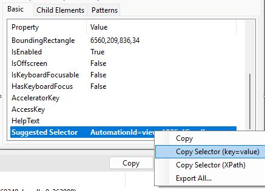
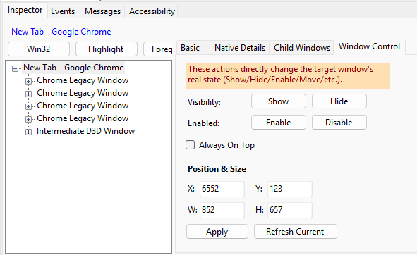
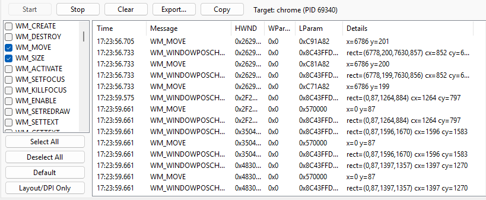
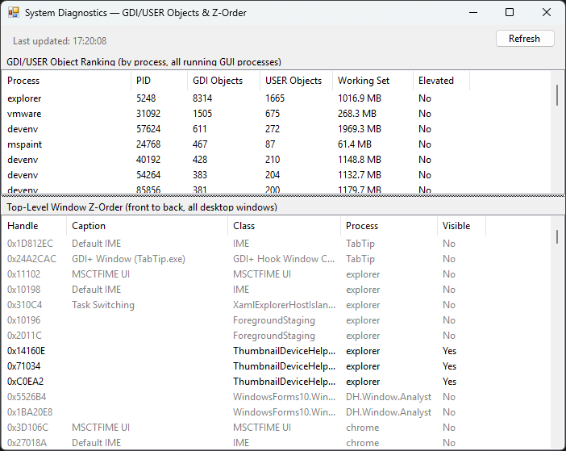
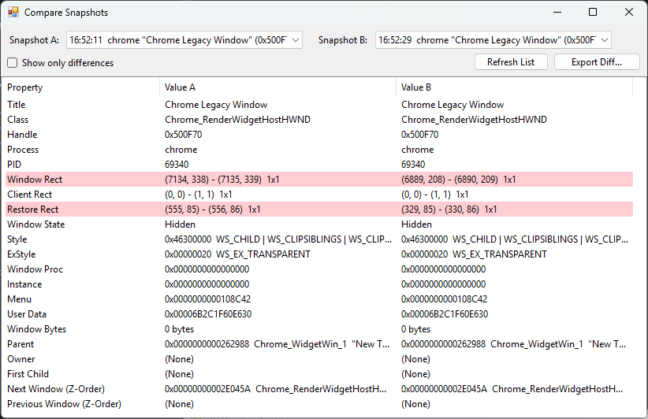

[English](README.md) | 한국어

# DH.Window.Analyst

Windows 데스크톱 UI 구조를 분석하는 Windows 전용 데스크톱 도구입니다. Spy++, Inspect.exe, Accessibility Insights for Windows와 유사한 목적을 가지되, 세 도구가 각자 따로 제공하던 것을 하나로 묶습니다.

- **Spy++**: Win32 저수준 속성(Style/ExStyle/Class Info, Window Message)은 보여주지만 UI Automation(UIA)은 모름
- **Inspect.exe**: UIA 트리/속성은 보여주지만 Win32 저수준 정보는 없음
- **Accessibility Insights**: 접근성 규칙 검사에 특화되어 있지만 그 외 범용 조회 기능은 없음

DH.Window.Analyst는 Win32와 UIA를 함께 다루면서, 단순 조회에 그치지 않고 UI Automation 액션(Invoke/Toggle/SetValue 등)을 직접 실행하고, WinEvent/Window Message 실시간 모니터링까지 지원합니다. QA/테스트 자동화 엔지니어, RPA 개발자, 접근성(Accessibility) 테스터, 그리고 일반 개발자의 디버깅 용도를 함께 고려해 만들었습니다.

속성 패널의 General/Style/Class Info/Windows(관계) 탭 구성과 Finder Tool의 드래그 픽업 방식 등 여러 부분은 Spy++와 Inspect.exe가 오랫동안 제공해 온 정보 구성을 참고해 설계했습니다. 두 도구 모두 Visual Studio/Windows SDK에 포함된 마이크로소프트의 기존 진단 도구이며, 이 프로젝트는 그 정보 구성 방식을 참고하되 UIA 통합·실시간 모니터링·액션 실행 등을 더한 독립 구현입니다.


## 주요 기능

**창 탐색**
- 최상위 윈도우 목록 조회(Win32 `EnumWindows` 기반), 프로세스별 그룹핑/검색/Instant Find
- Win32 트리 ↔ UI Automation(UIA) 트리 토글, 지연 로딩(lazy loading)
- UIA 트리 Control View 토글(기본값 RawView, ControlView는 Legacy IAccessible 브릿지 중복 피어를 걸러내 Sync/트리 탐색 시 노이즈 감소)
- 커서로 대상을 직접 지정하는 Finder Tool(Spy++ 스타일 드래그 픽업)
- 캡션/클래스명/핸들 기본 검색 + PID/ProcessName/ControlId/AutomationId/UIA Name/ControlType 확장 검색(Find Window)
- "Show Info on Mouse" 전역 마우스 Picker — 다른 프로세스 창 위에서도 호버 정보/하이라이트 실시간 표시, 클릭으로 즉시 선택


**속성/구조 조회**
- 기본 정보, Win32 저수준 속성(Window/Client/Restore Rect, Style/ExStyle, Window Proc, Class 정보 등 Spy++ 스타일 전 항목), 자식 윈도우 요약
- 창 관계 정보(Parent/Owner/First Child/Next/Previous, Z-Order)
- UIA 속성 및 Child Elements 조회, 신뢰도 순 폴백(AutomationId → Name+ControlType → ClassName+ControlType)으로 추천하는 "Suggested Selector" — 자동화 스크립트용으로 key=value/XPath 두 포맷 복사 지원
- Selector2(AutomationId/Name/ClassName/ControlType을 전부 AND 조합 — 속성 하나만으로 애매한 경우 대비), KeyPath(형제 인덱스 경로, 예: `0/2/1`), TypePath(ControlType 경로, 예: `.\pane\pane\...\combo box`) 추가 폴백 제공
- 선택 요소 하이라이트 오버레이, 전면 전환(Foreground)



**실행/액션**
- UI Automation 패턴 실행 — Invoke, Toggle, ExpandCollapse, Selection, GetValue/SetValue
- 창 상태 제어 — Win32 창은 Show/Hide/Enable/Disable/Move/Resize/Always On Top, UIA 요소는 Window/Transform 패턴 기반 Minimize/Maximize/Restore/Close/Move/Resize/Rotate
- 접근성 규칙 검사(UIA 트리 순회 기반 Name/KeyboardFocusable/AutomationId 규칙, 진단 리포트)



**실시간 모니터링**
- WinEvent 모니터링(`SetWinEventHook` — Create/Destroy/Show/Hide/Focus/Selection/StateChange 등)
- Window Message 로깅(`WH_CALLWNDPROC`/`WH_GETMESSAGE`, 네이티브 후킹 DLL 기반), `WM_SIZE`/`WM_MOVE`/`WM_WINDOWPOSCHANGED`/`WM_DPICHANGED`의 Rect/DPI 값을 디코딩해 표시하고 "Layout/DPI Only" 필터 프리셋 원클릭 적용




**진단 & 비교**
- System Diagnostics 대화상자 — 특정 창이 아닌 시스템 전체 GDI/USER 오브젝트 랭킹, 데스크톱 전체 Z-order 스택
- A/B Property Snapshot Compare — 두 시점의 속성 스냅샷(Inspector에서 선택 중인 Win32 창 또는 UIA 요소)을 캡처해 나란히 비교(diff), 결과 Export 지원
- 메인 창 하단에 상시 표시되는 실시간 로그 뷰어 패널(Debug/Info/Warn/Error, 필터 가능)




**기타**
- 속성/이벤트/메시지 로그 CSV·JSON Export, 클립보드 복사
- 설정 대화상자(General/Logging/Inspector), 레지스트리 기반 설정 저장
- 관리자 권한(elevated) 대상에 대한 UIPI 제약 사전 감지 및 안내

## 설계 원칙

**"분석 대상이 Hang되어도 Inspector는 Hang되지 않는다."**

분석 대상 프로세스가 응답 없음 상태여도 이 도구 자체는 멈추지 않아야 한다는 원칙을 UI 스레드 오프로딩, 저수준 후킹 콜백의 최소 작업화, UIA 순회 방문 상한, 네이티브 워커 스레드 격리, UIPI 실패를 예외 대신 값으로 흡수하는 방식으로 지킵니다.

## 다운로드

버전 태그가 push될 때마다 [Releases](../../releases) 페이지에 빌드된 실행 파일이 자동으로 올라갑니다. 직접 빌드하지 않고 바로 실행해보고 싶다면 최신 zip을 받으시면 됩니다.

## 요구 사항

- Windows 10/11
- .NET Framework 4.6 이상
- Visual Studio 2022 (C++ 데스크톱 개발 워크로드 포함 — 네이티브 후킹 DLL 빌드에 필요)

## 빌드 방법

`DH.Window.AnalystSol.sln`을 Visual Studio 2022로 열어 빌드/실행합니다. 솔루션은 4개 프로젝트로 구성되며, WinForm 앱(`DH.Window.Analyst`)이 나머지를 참조합니다.

```
cd projectroot/DH.Window.AnalystSol
dotnet build DH.Window.AnalystSol.sln
```

Message Logging 기능은 별도 네이티브 DLL(`DH.Window.Analyst.HookNative`, x86/x64)을 대상 프로세스 비트니스에 맞춰 동적 로드합니다. 솔루션 빌드 시 x86/x64 두 구성 모두 함께 빌드되도록 되어 있어, C++ 워크로드가 설치되어 있지 않으면 이 부분만 빌드가 실패할 수 있습니다.

## 프로젝트 구조

```
DH.Window.AnalystSol/
├── DH.Window.AnalystSol.sln
└── workspace/
    ├── DH.Window.Analyst.Core/         # 공유 로직 — Models, Win32/UIA 서비스 (UI 프레임워크 비의존)
    ├── DH.Window.Analyst/              # WinForm 메인 애플리케이션 (MainForm, 진입점)
    ├── DH.Window.Analyst.UI/           # WinForm 재사용 UserControl/Dialog 라이브러리
    └── DH.Window.Analyst.HookNative/   # Window Message 후킹용 네이티브 DLL (C++, x86/x64)
```

- `DH.Window.Analyst.Core`는 UI 프레임워크에 의존하지 않는 순수 로직(Models/Services)만 담고 있습니다.
- 화면 조회는 Win32 API(`EnumWindows` 등)로 즉시 처리하고, 사용자가 선택한 창 1개에 한해서만 UI Automation(UIA)으로 변환하는 구조를 핵심 설계 원칙으로 삼고 있습니다.
- `DH.Window.Analyst.HookNative`는 Window Message 로깅을 위해 대상 프로세스 주소 공간에 실제로 매핑되는 유일한 네이티브 모듈이며, 훅 프로시저는 최소 작업(링버퍼 push)만 수행하고 별도 워커 스레드가 배치 전송을 담당해 대상 프로세스의 메시지 펌프를 막지 않습니다.

## 알려진 제약 / 로드맵

- Win32 트리와 UIA 트리는 현재 별개 토글 방식이며, 하나의 트리에 중첩(nested)해서 보여주는 완전 통합은 아직 미구현입니다.
- 화면 실시간 미리보기/캡처(Windows Graphics Capture 기반)는 미구현입니다.
- 액션 레코딩 → 스크립트 생성/export 기능은 설계만 되어 있고 착수 전입니다.

## 라이선스

[MIT License](LICENSE)
