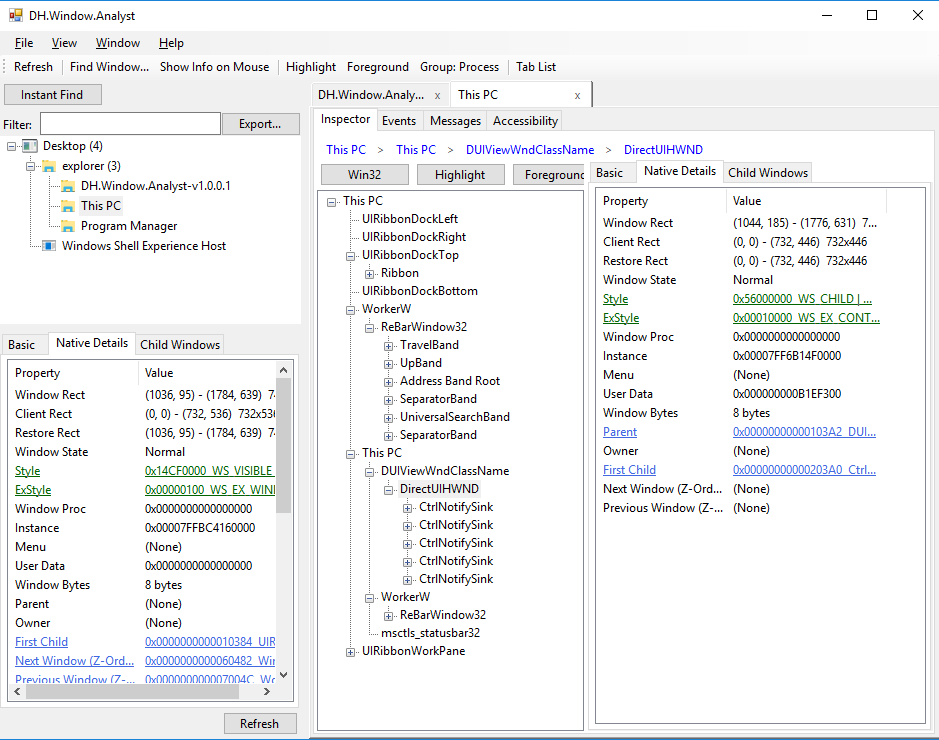
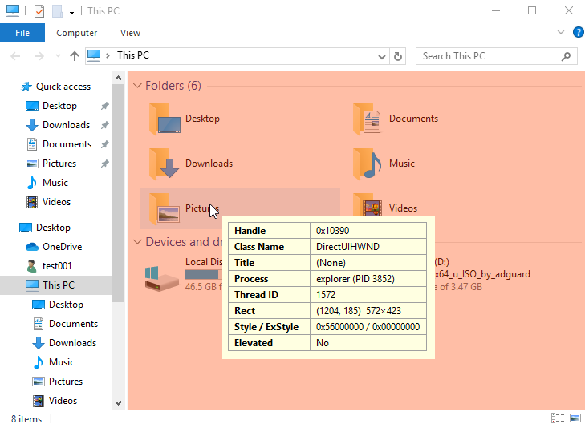
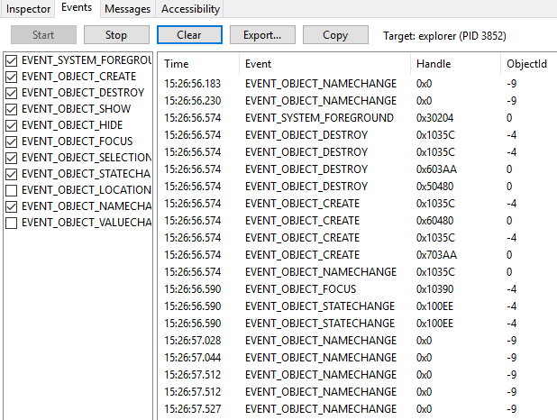
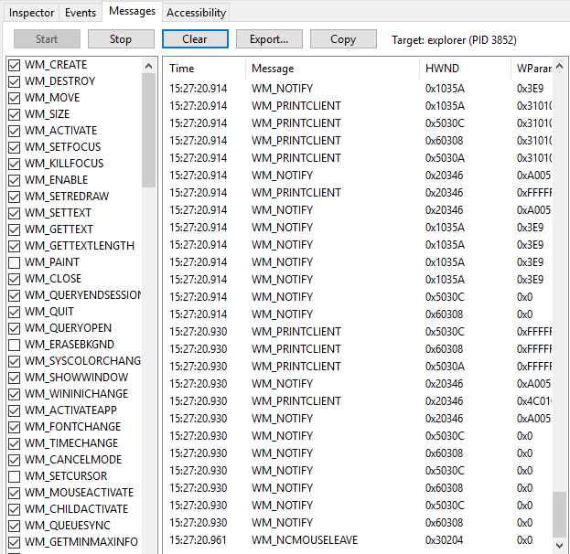

English | [한국어](README.ko.md)

# DH.Window.Analyst

A Windows-only desktop tool for inspecting Windows desktop UI structure. It serves a similar purpose to Spy++, Inspect.exe, and Accessibility Insights for Windows, but brings together what those three tools each provide separately.

- **Spy++**: shows low-level Win32 properties (Style/ExStyle/Class Info, Window Messages) but knows nothing about UI Automation (UIA)
- **Inspect.exe**: shows the UIA tree/properties but has no low-level Win32 information
- **Accessibility Insights**: specialized for accessibility rule checking, but lacks general-purpose inspection features

DH.Window.Analyst handles both Win32 and UIA together, and goes beyond passive inspection — it can directly execute UI Automation actions (Invoke/Toggle/SetValue, etc.) and monitor WinEvents/Window Messages in real time. It's built with QA/test-automation engineers, RPA developers, accessibility testers, and general developers debugging their own apps all in mind.

Several parts of the design — the property panel's General/Style/Class Info/Windows (relationship) tabs and the Finder Tool's drag-to-pick interaction — were informed by the long-standing information layout of Spy++ and Inspect.exe. Both are existing Microsoft diagnostic tools bundled with Visual Studio/Windows SDK; this project references their information layout while adding UIA integration, real-time monitoring, and action execution as an independent implementation.



## Key Features

**Window Exploration**
- Top-level window listing (Win32 `EnumWindows`-based), with per-process grouping/search/Instant Find
- Win32 tree ↔ UI Automation (UIA) tree toggle, with lazy loading
- Finder Tool for picking a target by cursor (Spy++-style drag pickup)
- Basic search by Caption/ClassName/Handle, plus extended search by PID/ProcessName/ControlId/AutomationId/UIA Name/ControlType (Find Window)
- "Show Info on Mouse" global mouse picker — live hover info/highlight over windows in any process, click to select instantly



**Property/Structure Inspection**
- Basic info, low-level Win32 properties (Window/Client/Restore Rect, Style/ExStyle, Window Proc, Class info, etc. — full Spy++-style coverage), child window summary
- Window relationship info (Parent/Owner/First Child/Next/Previous, Z-Order)
- UIA property and Child Elements inspection
- Selection highlight overlay, bring-to-foreground

**Execution/Actions**
- UI Automation pattern execution — Invoke, Toggle, ExpandCollapse, Selection, GetValue/SetValue
- Accessibility rule checking (UIA tree traversal-based Name/KeyboardFocusable/AutomationId rules, diagnostic report)

**Real-Time Monitoring**
- WinEvent monitoring (`SetWinEventHook` — Create/Destroy/Show/Hide/Focus/Selection/StateChange, etc.)
- Window Message logging (`WH_CALLWNDPROC`/`WH_GETMESSAGE`, native hook DLL-based)




**Other**
- CSV/JSON export and clipboard copy for property/event/message logs
- Options dialog (General/Logging/Inspector), registry-based settings storage
- Proactive detection and notice of UIPI restrictions against elevated targets

## Design Principle

**"The inspector must not hang, even when the target being analyzed hangs."**

This principle — that the tool itself must keep running even when the target process stops responding — is upheld through UI-thread offloading, keeping low-level hook callbacks minimal, capping UIA traversal visit counts, isolating native worker threads, and treating UIPI failures as ordinary return values instead of exceptions.

## Download

Prebuilt binaries are published on the [Releases](../../releases) page whenever a version tag is pushed. If you just want to run the tool without building it yourself, grab the latest zip from there.

## Requirements

- Windows 10/11
- .NET Framework 4.6 or later
- Visual Studio 2022 (with the "Desktop development with C++" workload — required to build the native hook DLL)

## Build

Open `DH.Window.AnalystSol.sln` in Visual Studio 2022 to build and run. The solution consists of 4 projects, with the WinForm app (`DH.Window.Analyst`) referencing the rest.

```
cd projectroot/DH.Window.AnalystSol
dotnet build DH.Window.AnalystSol.sln
```

The Message Logging feature dynamically loads a separate native DLL (`DH.Window.Analyst.HookNative`, x86/x64) matching the target process's bitness. The solution is set up to build both x86 and x64 configurations, so this part alone can fail to build if the C++ workload isn't installed.

## Project Structure

```
DH.Window.AnalystSol/
├── DH.Window.AnalystSol.sln
└── workspace/
    ├── DH.Window.Analyst.Core/         # Shared logic — Models, Win32/UIA services (UI-framework-independent)
    ├── DH.Window.Analyst/              # WinForm main application (MainForm, entry point)
    ├── DH.Window.Analyst.UI/           # Reusable WinForm UserControl/Dialog library
    └── DH.Window.Analyst.HookNative/   # Native DLL for Window Message hooking (C++, x86/x64)
```

- `DH.Window.Analyst.Core` contains only pure logic (Models/Services) with no UI framework dependency.
- The core design principle is that window enumeration happens immediately via Win32 APIs (`EnumWindows`, etc.), while UI Automation (UIA) conversion is deferred to only the single window the user has selected.
- `DH.Window.Analyst.HookNative` is the only native module that actually gets mapped into the target process's address space for Window Message logging. Its hook procedure does minimal work (ring-buffer push) and a separate worker thread handles batched delivery, so the target process's message pump is never blocked.

## Known Limitations / Roadmap

- The Win32 tree and UIA tree are currently a toggle between two separate trees; full integration where the UIA subtree is nested under Win32 nodes is not yet implemented.
- Live screen preview/capture (Windows Graphics Capture-based) is not implemented.
- Action recording → script generation/export is designed but not yet started.

## License

[MIT License](LICENSE)
